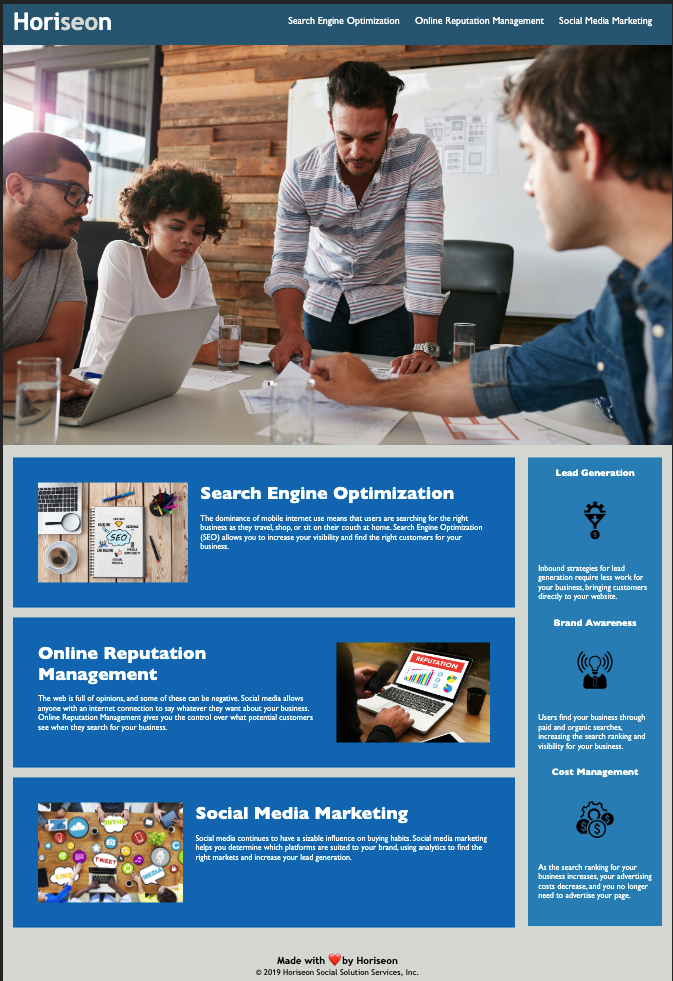

# Unit1 Homework: Code Refactor
Purpose: Refactoring the Horiseon company website for better accessibility

URL: https://cristina-gorrino.github.io/unit1-hmwk-code-refactor

## Description:
This project involved taking an existing landing page and refactoring the html and css code so that it is more accessible, and the code is easier to maintain.

### Summary of changes
- Changed html to use more semantic elements
- Removed redundant class attributes and for better clarity
- Ensured all nav links are working
- Combined repetitive css styles and used updated selectors
- Added clarifying comments to css stylesheet
- Added alt attributes to images

## Visuals
Example of design and function of website

